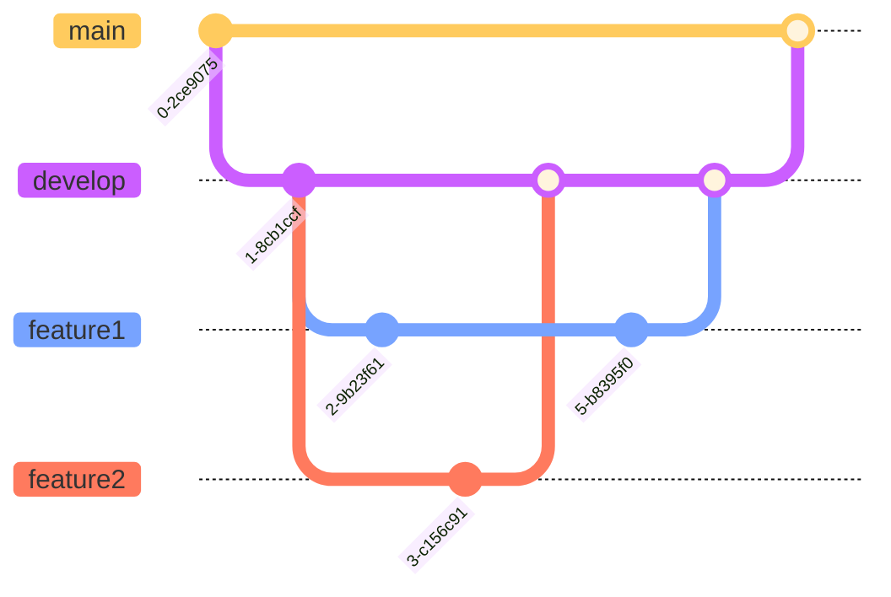

# wakuwaku
ハックツハッカソンアロカップ チームわくわくのリポジトリ


## 開発方法
```
npm start
```
プレビュー
http://localhost:3000/


## ページ
* ホーム http://localhost:3000/
* 投稿画面 http://localhost:3000/post
* マイページ http://localhost:3000/mypage
* コンテンツ http://localhost:3000/content/example


## ブランチ
事前開発の段階ではdevelopからブランチを切って作業してほしいです。



## ライブラリなど
* [styled components](https://styled-components.com/)
* [Material UI](https://mui.com/)
* [matter.js](https://brm.io/matter-js/)
